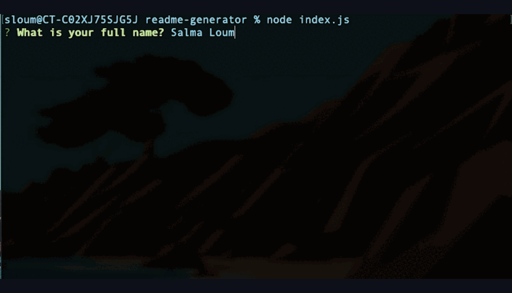

# README Generator

## Badge

## Description

This utility allows developers to create a professional README file using the command line.

## Table of Contents

- [Installation](#installation)
- [Usage](#usage)
- [Credits](#credits)
- [License](#license)
- [Contributing](#contributing)
- [Questions](#questions)

## Installation

Create a .gitignore file and include node_modules/ and .DS_Store/ so that your node_modules directory isn't tracked or uploaded to GitHub. Be sure to create your .gitignore file before installing any npm dependencies.

## Usage

Make sure that your repo includes a package.json with the required dependencies. You can create one by running npm init when you first set up the project, before installing any dependencies.

## Credits

- [Salma Loum](https://github.com/SalmaLoum)
- [UCLA Extension Bootcamp](https://www.uclaextension.edu/?gclid=Cj0KCQiAgribBhDkARIsAASA5btdbwAz8x25r3b1deoRNIGxfkPFL11rAQMuCgQ7HYiqBH8CLr9CgLoaAktlEALw_wcB&gclsrc=aw.ds)

## License

Please refer to the LICENSE in the repo.

## Contributing

N/A

## Tests

After opening your terminal and navigating to the repo's clone,
type node index.js to start the application through your terminal, and follow the prompt as shown below:

## Questions

- For any questions related to this app, please contact: goforsalma@gmail.com.
- You can access my Github profile here: [https://github.com/SalmaLoum](https://github.com/SalmaLoum)

---
